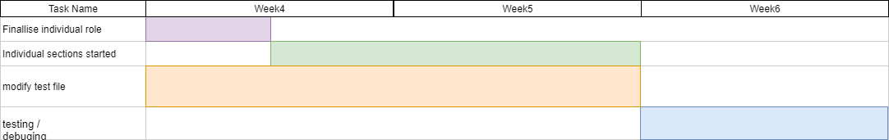

PLAN

Introduction:

Our team met together outside of class on Thursday of week 2 to discuss expectations and roles for individual members of the group. We concluded that we should be able to meet twice on a weekly basis, on Mondays and Thursdays. This will allow us to check in to where the other group members are at and allow effective collaboration and review of others' work. We also created a group chat on Messenger so that we can ask questions and check in with each other in-between meetings. We also discussed a potential timeline for the project as a whole, as well as a possible development plan based on the information we have been given so far.

Timeline and development plan:

Iteration 1

Sun 22 Sep: Specifications for iteration released

Thu 26 Sep: Discuss specification and assign individual roles

Mon 30 Sep: Drafts of all sections completed (excluding reflection). Commence editing and collaborating on each other's work.

Thu 3rd Oct: Finish editing, complete reflection.

Sat 5th Oct: Submit iteration 1 on gitlab.

Sun 6th Oct: Due date for iteration 1 at 8 pm.

Mon 7th Oct: Prepare for demonstration to tutor, start thinking about iteration 2.

Tue 8th Oct: Demo for iteration 1 to tutor in our lab.

Iteration 2

Week 4: Everyone modifies the pytests from iteration 1 to better suit the new specs, and Angeline finishes working on functions starting with "auth_".

Week 5: Meilin finishes working on "channel" functions, Eric finishes working on "messages" functions, Yimeng finishes working on "user_profile" functions and Angeline finishes working on "standup", "search" and "admin" functions.

Week 6: Testing and debugging.

Sat 26th Oct: Submit iteration 2 on gitlab.

Sun 27th Oct: Due date for iteration 2 at 8 pm.

Mon 28th Oct: Prepare for demonstration to tutor, start thinking about iteration 3.

Tue 29th Oct: Demo for iteration 2 to tutor in our lab.

Iteration 3

Sun 17th Nov: Iteration 3 due.

Tue 19th Nov: Demo for iteration 3 to tutor in our lab.

Timeline diagram:

Conclusion:

To conclude, our team has made a strong plan which we believe we will be able to stick to through this and future iterations of the project. We are content with our ability to work as a team and expect the project to progress smoothly.
